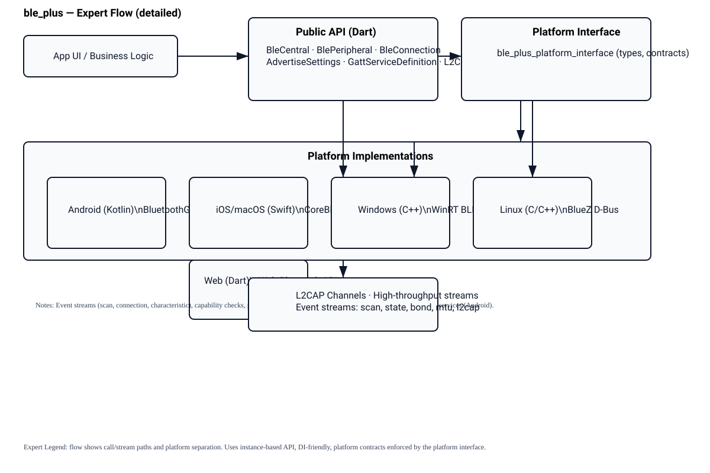
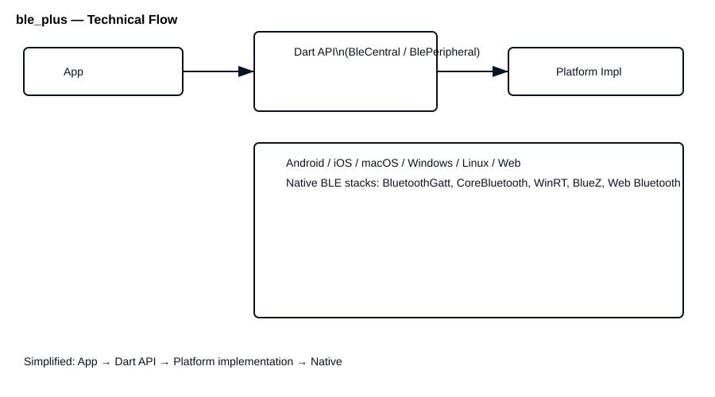

# ble_plus

A production-ready Flutter BLE plugin with comprehensive Central and Peripheral APIs, L2CAP channels, background support, and robust error handling across Android, iOS, macOS, Windows, Linux, and Web.

[](https://pub.dev/packages/ble_plus) [](LICENSE)

Explain like I'm a child

This plugin helps your app talk to tiny electronic friends (like smart toys, heart-rate bands, or temperature sensors) using Bluetooth. Imagine:

- Your phone looks around the room to find friends (scan).
- Your phone says "Hi! Can we talk?" (connect).
- They send short messages back and forth (read, write, notify).
- Your app can also pretend to be a friend so other phones can talk to it (peripheral).

Use BleCentral to find and talk to devices, BlePeripheral to advertise and serve data, and BleConnection to read/write messages. That's all — like playing catch with tiny messages!

Table of contents
- Features
- Installation
- Platform setup (Android, iOS, macOS, Windows, Linux, Web)
- Quick examples (Central, Peripheral, L2CAP)
- API highlights
- Error handling
- Background operation
- Troubleshooting
- Contributing
- License

Features
- Central: scan, connect, discover services, read/write/subscribe characteristics, descriptors, MTU/RSSI where available
- Peripheral: advertise, GATT server, handle read/write requests, notifications/indications, publish L2CAP channels
- L2CAP: high-throughput streaming on supported platforms (Android 10+, iOS 11+, macOS 10.14+)
- Background: iOS state-restoration, Android foreground-service architecture
- Bond/Pair management and bond state streams
- Instance-based API for testability and dependency injection
- Unified, typed error model (BleError hierarchy)

Installation
1. Add the dependency to your pubspec.yaml:

```yaml
dependencies:
  ble_plus: ^1.0.1
```

2. Run:
```bash
flutter pub get
```

Platform setup

Android
- Min SDK: API 21 (some features require higher API levels)
- Add permissions to AndroidManifest.xml (Android 12+ requires BLUETOOTH_SCAN/CONNECT/ADVERTISE):
```xml
<uses-permission android:name="android.permission.BLUETOOTH_SCAN" />
<uses-permission android:name="android.permission.BLUETOOTH_CONNECT" />
<uses-permission android:name="android.permission.BLUETOOTH_ADVERTISE" />
<uses-permission android:name="android.permission.ACCESS_FINE_LOCATION" />
```
- For advertising on Android 12+, include BLUETOOTH_ADVERTISE and request runtime permissions.

iOS / macOS
- Add to Info.plist:
```xml
<key>NSBluetoothAlwaysUsageDescription</key>
<string>This app uses Bluetooth to communicate with BLE devices.</string>
<key>NSBluetoothPeripheralUsageDescription</key>
<string>This app may advertise as a Bluetooth peripheral.</string>
```
- To support background restores on iOS, add UIBackgroundModes with bluetooth-central and bluetooth-peripheral.
- Swift Package Manager: Package.swift files are provided under ios/ble_plus and macos/ble_plus for SPM integration.

Web
- Web supports Central role only via the Web Bluetooth API. Requires HTTPS and user gesture for scanning (device picker on Chrome/Edge).

Linux
- Uses BlueZ D-Bus API. Ensure `bluez` is installed on the host system.

Windows
- Uses WinRT BLE APIs. Requires Windows 10 or later.

Quick examples

Central (scan + connect):
```dart
final central = BleCentral();

central.startScan(withServices: [Guid('180D')]).listen((result) {
  print('Found: ${result.device.displayName} (${result.device.id})');
});

final conn = await central.connect(device);
final services = await conn.discoverServices();
await conn.readCharacteristic(services[0].characteristics[0]);
await conn.disconnect();
```

Peripheral (advertise + GATT server):
```dart
final peripheral = BlePeripheral();
await peripheral.addService(GattServiceDefinition(
  uuid: Guid('180D'),
  characteristics: [
    GattCharacteristicDefinition(
      uuid: Guid('2A37'),
      properties: CharacteristicProperties(notify: true, read: true),
      permissions: CharacteristicPermissions(read: true),
    ),
  ],
));

await peripheral.startAdvertising(AdvertiseSettings(localName: 'MyDevice', serviceUuids: [Guid('180D')]));
```

L2CAP (high-throughput streaming):
```dart
final channel = await connection.openL2CapChannel(psm, secure: true);
channel.inputStream.listen((data) => print('Received: $data'));
await channel.write([1,2,3]);
await channel.close();
```

API highlights
- BleCentral: startScan(), stopScan(), connect(), capabilities
- BleConnection: discoverServices(), readCharacteristic(), writeCharacteristic(), subscribeToCharacteristic(), readDescriptor(), writeDescriptor(), requestMtu(), readRssi(), openL2CapChannel()
- BlePeripheral: addService(), removeService(), startAdvertising(), stopAdvertising(), onCentralConnected, onReadRequest, notifyCharacteristic(), publishL2CapChannel()
- AdvertiseSettings, GattServiceDefinition, GattCharacteristicDefinition, CharacteristicProperties, CharacteristicPermissions

API usage & documentation
- API reference online: https://pub.dev/documentation/ble_plus/latest/
- Example code: see packages/ble_plus/example and example/ for runnable sample apps demonstrating Central and Peripheral flows.
- Key usage patterns:
  - Scanning: central.startScan(withServices: [...]).listen((result) { ... });
  - Connecting: final conn = await central.connect(device);
  - Read/Write: await conn.readCharacteristic(characteristic); await conn.writeCharacteristic(characteristic, [0x01]);
  - Notifications: conn.subscribeToCharacteristic(char).listen((data) { ... });
  - Peripheral: peripheral.addService(...); await peripheral.startAdvertising(settings);

Generate docs locally
- Ensure dependencies: flutter pub get
- Generate API docs: dart doc --output-dir=doc/api (or use dartdoc if preferred)
- View generated docs at doc/api/index.html

APIs used & platform mapping
This package provides a single Dart API surface that delegates to platform-specific implementations via the platform interface (ble_plus_platform_interface). Each platform implementation maps the high-level operations to native OS BLE APIs:

- Android (Kotlin)
  - Core Android BLE APIs and classes used:
    - android.bluetooth.BluetoothManager (adapter access)
    - android.bluetooth.BluetoothAdapter
    - android.bluetooth.le.BluetoothLeScanner (startScan/stopScan)
    - android.bluetooth.le.ScanCallback / ScanFilter / ScanSettings
    - android.bluetooth.BluetoothDevice (getAddress, createBond, openL2capChannel on API 29+)
    - android.bluetooth.BluetoothGatt (connectGatt, requestMtu, readCharacteristic, writeCharacteristic)
    - android.bluetooth.BluetoothGattCallback (onConnectionStateChange, onServicesDiscovered, onCharacteristicRead/onCharacteristicWrite, onCharacteristicChanged, onMtuChanged, onReadRemoteRssi)
    - android.bluetooth.BluetoothGattServer & BluetoothGattServerCallback (peripheral/GATT server handlers)
    - android.bluetooth.le.BluetoothLeAdvertiser, AdvertiseSettings, AdvertiseData, AdvertiseCallback (advertising)
    - Pairing APIs: createBond(), removeBond()
  - Responsibilities: scanning, connecting, service discovery, GATT read/write/notify, advertising/GATT server, L2CAP channels (API 29+), MTU and RSSI requests.
  - Notes: request runtime permissions (BLUETOOTH_SCAN, BLUETOOTH_CONNECT, BLUETOOTH_ADVERTISE, ACCESS_FINE_LOCATION) and use a foreground service for reliable background scanning/advertising.

- iOS / macOS (Swift — CoreBluetooth)
  - Core CoreBluetooth APIs and types used:
    - CBCentralManager (scanForPeripherals, connect)
    - CBPeripheral and CBPeripheralDelegate (discoverServices, discoverCharacteristics, readValue, writeValue, setNotifyValue)
    - CBCentralManagerDelegate methods (didDiscover, didConnect, didFailToConnect, didDisconnectPeripheral)
    - CBPeripheralManager (peripheral role), CBPeripheralManagerDelegate (didReceiveRead/didReceiveWrite, central subscribed/unsubscribed)
    - CBMutableService, CBMutableCharacteristic, CBUUID, CBATTRequest
    - State restoration keys (CBCentralManagerOptionRestoreIdentifierKey / CBPeripheralManagerOptionRestoreIdentifierKey)
    - L2CAP channel APIs introduced in recent OS versions (iOS 11+/macOS 10.14+) where available
  - Responsibilities: scanning/connecting, GATT server/advertising for peripheral role, handling read/write requests, notifications, L2CAP when supported, iOS state restoration for background operation.
  - Notes: include NSBluetoothAlwaysUsageDescription, NSBluetoothPeripheralUsageDescription and UIBackgroundModes for background restores.

- Windows (WinRT / UWP)
  - WinRT BLE APIs used:
    - Windows.Devices.Bluetooth.BluetoothLEAdvertisementWatcher (scanning)
    - Windows.Devices.Bluetooth.BluetoothLEDevice (device connection)
    - Windows.Devices.Bluetooth.GenericAttributeProfile.GattDeviceService, GattCharacteristic, GattCharacteristic.ValueChanged
    - Windows.Devices.Bluetooth.Advertisement.BluetoothLEAdvertisementPublisher (advertising)
    - GattServiceProvider for hosting GATT services (peripheral support where available)
    - APIs for pairing and device access via DeviceInformation.Pairing
  - Responsibilities: central operations, GATT read/write/notify, limited peripheral support depending on Windows version and APIs.

- Linux (BlueZ via D-Bus)
  - BlueZ D-Bus interfaces used:
    - org.bluez.Adapter1 (StartDiscovery/StopDiscovery)
    - org.bluez.Device1 (Connect, Disconnect, RSSI, GATT-related properties)
    - org.bluez.GattManager1 / org.bluez.GattService1 / org.bluez.GattCharacteristic1 (registering services, handling ReadValue/WriteValue/StartNotify)
    - org.bluez.LEAdvertisingManager1 / org.bluez.LEAdvertisement1 (advertising)
  - Responsibilities: central operations via D-Bus; optional peripheral/advertising support when LEAdvertisingManager is available. Requires bluez daemon and appropriate D-Bus permissions.

- Web (Web Bluetooth API)
  - Web APIs used:
    - navigator.bluetooth.requestDevice({filters, optionalServices})
    - BluetoothDevice.gatt.connect()
    - BluetoothRemoteGATTServer, BluetoothRemoteGATTService, BluetoothRemoteGATTCharacteristic
    - characteristic.readValue(), characteristic.writeValue(), characteristic.startNotifications(), characteristic.oncharacteristicvaluechanged
    - navigator.bluetooth.requestLEScan (experimental; availability varies by browser)
  - Responsibilities: central-only scanning via device picker, GATT interactions through browser APIs. Requires HTTPS and a user gesture to open the device picker (Chrome/Edge supported).

How it works (architecture & runtime flow)
1. App calls into the public Dart API (BleCentral/BlePeripheral).
2. The Dart API validates inputs, converts values (e.g., Guid types), and calls the platform interface methods.
3. Platform implementations (per platform) receive those calls and map them to native APIs. Results and events are marshalled back into Dart types.
4. Streams and event channels deliver asynchronous events: scan results, connection state, characteristic notifications, bond state, MTU changes, and L2CAP data.
5. The public API exposes Futures for single operations (connect, read, write) and Streams for continuous events (scan results, notifications).

Threading and permissions
- Native operations run on platform threads; results are posted back to Dart via platform channels.
- Permission checks are performed per-platform. On Android, request runtime permissions before scanning/connecting on modern OSes.

Limitations & platform differences
- Web: Central only, uses device picker; no background scanning or peripheral features.
- Linux/Windows: peripheral and L2CAP capability may be limited compared to Android/iOS/macOS.
- MTU and connection parameter APIs are platform-dependent (Android supports explicit MTU requests; iOS/macOS auto-negotiate).

Guidance for integrators
- Always check central.capabilities before using advanced features (peripheral, l2cap).
- Handle BleError subclasses explicitly to provide robust UX across platforms.
- For background scanning/advertising, implement platform-specific config (iOS Info.plist, Android foreground service setup).

Error handling
All errors extend BleError for exhaustive handling:
```dart
try {
  await connection.readCharacteristic(char);
} on BleTimeoutError catch (e) {
  // Handle
} on BleGattError catch (e) {
  // e.code available
}
```

Background operation
- iOS: use iosRestorationIdentifier via BleCentral.enableBackground to receive restored devices after app relaunch.
- Android: foreground service approach is required for reliable background scanning/advertising.

Troubleshooting
- Web: scanning opens device picker and requires user gesture + HTTPS.
- Linux: ensure BlueZ is installed and running.
- Android: check runtime permissions for BLUETOOTH_SCAN/CONNECT/ADVERTISE.

Contributing
- Run analyzer and tests:
```bash
flutter analyze
flutter test
```
- Follow the repo's contribution guidelines and add meaningful dartdocs when touching public APIs.

Native implementation examples & docs

This section shows minimal native snippets and official documentation links for each platform, useful for maintainers implementing or debugging the platform-side code.

- Android (Kotlin) — key classes: BluetoothManager, BluetoothAdapter, BluetoothLeScanner, BluetoothGatt, BluetoothGattServer, AdvertiseSettings.

Kotlin scan snippet:

```kotlin
val bluetoothManager = context.getSystemService(Context.BLUETOOTH_SERVICE) as BluetoothManager
val adapter = bluetoothManager.adapter
val scanner = adapter.bluetoothLeScanner
val scanCallback = object : ScanCallback() {
  override fun onScanResult(callbackType: Int, result: ScanResult) {
    // handle scan result
  }
}
val filters = listOf(ScanFilter.Builder().setServiceUuid(ParcelUuid(UUID.fromString("0000180D-0000-1000-8000-00805f9b34fb"))).build())
val settings = ScanSettings.Builder().setScanMode(ScanSettings.SCAN_MODE_LOW_LATENCY).build()
scanner.startScan(filters, settings, scanCallback)
```

Docs: https://developer.android.com/guide/topics/connectivity/bluetooth

- iOS / macOS (Swift — CoreBluetooth) — key classes: CBCentralManager, CBPeripheral, CBPeripheralManager, CBMutableService, CBMutableCharacteristic.

Swift scan snippet:

```swift
let central = CBCentralManager(delegate: self, queue: nil)
central.scanForPeripherals(withServices: [CBUUID(string: "180D")], options: nil)

// implement CBCentralManagerDelegate methods: didDiscover, didConnect, didFailToConnect, didDisconnectPeripheral
```

Docs: https://developer.apple.com/documentation/corebluetooth

- Windows (WinRT/UWP) — key APIs: BluetoothLEAdvertisementWatcher, BluetoothLEDevice, GattDeviceService, GattCharacteristic.

C# (UWP) scan snippet:

```csharp
var watcher = new BluetoothLEAdvertisementWatcher();
watcher.Received += (sender, args) => {
  // args contains advertisement data
};
watcher.Start();
```

Docs: https://learn.microsoft.com/windows/uwp/devices-sensors/gatt-client

- Linux (BlueZ via D-Bus) — key interfaces: org.bluez.Adapter1, org.bluez.Device1, org.bluez.GattManager1, org.bluez.GattCharacteristic1.

Command-line / shell example (quick test):

```bash
# Use bluetoothctl for quick manual testing
bluetoothctl
# in bluetoothctl: scan on
# watch for discovery events
```

Python + pydbus minimal pattern:

```python
from pydbus import SystemBus
bus = SystemBus()
adapter = bus.get('org.bluez', '/org/bluez/hci0')
adapter.StartDiscovery()
```

Docs and BlueZ D-Bus references: https://git.kernel.org/pub/scm/bluetooth/bluez.git/tree/doc

- Web (Web Bluetooth API) — key APIs: navigator.bluetooth.requestDevice, BluetoothRemoteGATTServer, BluetoothRemoteGATTCharacteristic.

JavaScript snippet:

```javascript
const device = await navigator.bluetooth.requestDevice({ filters: [{ services: ['heart_rate'] }] });
const server = await device.gatt.connect();
const service = await server.getPrimaryService('heart_rate');
const char = await service.getCharacteristic('heart_rate_measurement');
await char.startNotifications();
char.addEventListener('characteristicvaluechanged', (evt) => {
  // parse evt.target.value
});
```

Docs: https://web.dev/bluetooth/ and https://developer.mozilla.org/en-US/docs/Web/API/Web_Bluetooth_API

Flowcharts

## Expert flow (/expert)



The expert diagram shows the full architecture and data/control paths:
- App UI and business logic invoke the Dart public API (BleCentral/BlePeripheral).
- Public API forwards calls to the platform interface (contracts, types) and exposes reactive streams for scans, connections, characteristics, bond state, MTU, and L2CAP channels.
- Platform implementations (Android/iOS/macOS/Windows/Linux/Web) map the platform interface to native stacks (BluetoothGatt, CoreBluetooth, WinRT, BlueZ, Web Bluetooth).
- L2CAP channels and background/foreground behavior are highlighted: iOS state-restoration and Android foreground services.

## Technical flow (/technical)



A simplified flow for onboarding new integrators: App → Dart API → Platform implementation → Native BLE stack. This view focuses on call/response and payload flow rather than event stream minutiae.

License
BSD-3-Clause. See LICENSE.


